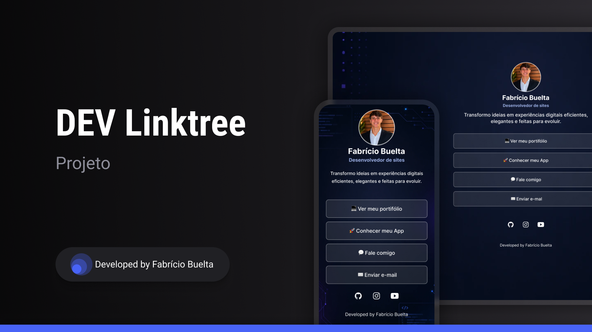

<h1 align="center"> Dev Linktree </h1>

Um hub simples e responsivo para reunir seus projetos, redes e contatos em um só lugar. 

  <a href="#-tecnologias">Tecnologias</a>&nbsp;&nbsp;&nbsp;|&nbsp;&nbsp;&nbsp;
  <a href="#-projeto">Projeto</a>&nbsp;&nbsp;&nbsp;|&nbsp;&nbsp;&nbsp;
  <a href="#-layout">Layout</a>&nbsp;&nbsp;&nbsp;|&nbsp;&nbsp;&nbsp;
  <a href="#memo-licença">Licença</a>

  

 

  

## 🚀 Tecnologias

Esse projeto foi desenvolvido com as seguintes tecnologias:

- HTML e CSS
- JavaScript
- Git e Github

## 💻 Projeto

O linktree foi desenvolvido para facilitar a chegada de novos clientes em potencial por Whatsapp ou E-mail, melhorar a exposição de projetos e oferecer profissionalismo.

## 🔖 Layout

Você pode visualizar o layout do projeto através [DESSE LINK](https://www.figma.com/design/BroacqmfP3gyZ3EuHOf9kV/Projeto-Linktree-1?node-id=10-620&t=e9xEUhGZDVN92pg3-1). É necessário ter conta no [Figma](https://figma.com) para acessá-lo.

## :memo: Licença

Esse projeto está sob a licença MIT.

---

Feito com ♥ por Fabricio Buelta.
